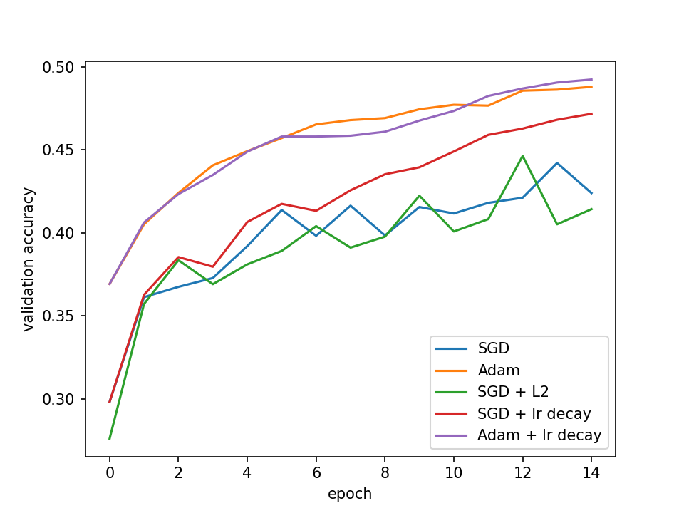

# Rust NN

Homework 1 for deep learning course @ FRI written in 🦀 (and python for plotting but let us ignore that).

## What
It's a minimal sequential nn implementation in Rust.
It only includes support for single input - single output layers.
Basically `nn.Sequential` from Pytorch but strictly worse.
It is minimal in the sense that I am lazy so I only implemented stuff necessary for this one specific homework.

It also includes SGD and Adam optimizers, exponential LR scheduler etc.

## Why
I was bored and wanted to learn Rust by actually implementing something and not just reading the book.
I already did something similar in [Java](https://github.com/rziga/JavaPostevanka), so I basically just rewrote the necessary parts of that project in Rust (literally rewrite in rust 🚀🤓🦀).

## Results

Adam doing its magic.

## How to run

1) Download CIFAR-10 bytes from [here](https://www.cs.toronto.edu/~kriz/cifar-10-binary.tar.gz) in `./data` and extract the batches in there.

2) Move to `./nn` directory and run `cargo run --release`.
The release flag is absolutely crucial if you don't want to have a run time in the range of days.
Optionally, capture the terminal output and save it into a file for further analysis.

## TODO
* I need to get better at Rust (will probably happen).
* Optimize matmul (will probably not happen here).
* Add layers, optimizers, datasets etc. (will probably never happen).